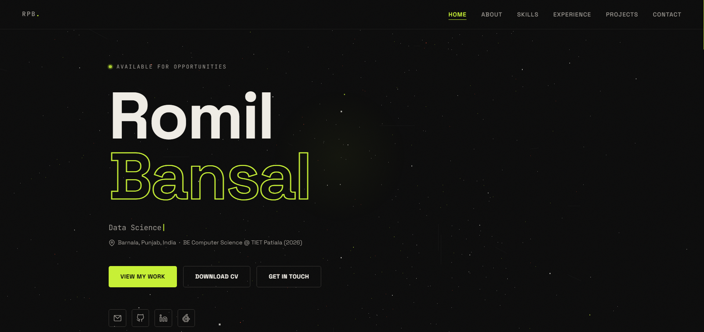

# 🚀 Romil Bansal — Personal Portfolio

> A 3D interactive portfolio built with vanilla HTML, CSS, and JavaScript — featuring a live Three.js particle background, GSAP scroll animations, and a Gen Z editorial design aesthetic.

**Live Site → [romil42.github.io/portfolio](https://Romil42.github.io/portfolio)**

---

## ✨ Features

- **3D Particle Background** — 1800 live particles with mouse parallax using Three.js
- **Typewriter Effect** — cycles through ML Engineer, Full Stack Dev, Computer Vision, and more
- **Scroll Animations** — skill bars, card stagger, and timeline slide-ins powered by GSAP
- **3D Card Tilt** — project cards tilt on mouse hover using CSS perspective
- **Cursor Glow** — subtle lime radial glow that follows the mouse
- **Active Nav Highlight** — navbar link highlights based on current scroll position
- **Fully Responsive** — mobile hamburger menu, fluid typography, adaptive grid layouts
- **No frameworks** — pure HTML + CSS + JS, no build tools, no npm

---

## 🛠️ Tech Stack

| Layer | Technology |
|---|---|
| 3D Scene | Three.js r128 |
| Animations | GSAP 3.12 + ScrollTrigger |
| Fonts | Space Grotesk + JetBrains Mono |
| Hosting | GitHub Pages |
| Languages | HTML5, CSS3, Vanilla JS |

---

## 📁 Project Structure

```
portfolio/
├── index.html        # All sections and markup
├── style.css         # Full design system + animations
├── main.js           # Three.js scene + GSAP + interactions
└── assets/
    ├── images/       # Profile photo
    └── resume.pdf    # Downloadable CV
```

---

## 🎨 Design System

| Token | Value | Usage |
|---|---|---|
| `--ink` | `#0C0C0C` | Page background |
| `--lime` | `#C8F135` | Primary accent |
| `--coral` | `#FF4D2E` | Secondary accent |
| `--chalk` | `#F0EDE6` | Primary text |
| `--chalk-dim` | `#9a9690` | Muted text |

---

## 📌 Sections

1. **Hero** — Name, animated role typewriter, social links
2. **About** — Bio, stats (3 projects, 95% CNN accuracy, 500K+ records)
3. **Skills** — Pill grid by category + animated proficiency bars
4. **Experience** — Vertical timeline (TIET education + Mudra Club)
5. **Projects** — 3D tilt cards for all 3 major projects
6. **Contact** — Email, phone, LinkedIn, GitHub, LeetCode cards

---

## 🚀 Run Locally

No install needed. Just clone and open:

```bash
git clone https://github.com/Romil42/portfolio.git
cd portfolio
# open index.html in your browser
```

Or with VS Code Live Server — right click `index.html` → **Open with Live Server**

---

## 🔄 Deploy Updates

```bash
git add .
git commit -m "your update message"
git push
```

GitHub Pages rebuilds automatically in ~2 minutes.

---

## 📬 Contact

**Romil Prince Bansal**
- Email: romilprince42@gmail.com
- GitHub: [@Romil42](https://github.com/Romil42)
- LinkedIn: [linkedin.com/in/romilbansal](https://linkedin.com/in/romilbansal)
- LeetCode: [leetcode.com/romilbansal](https://leetcode.com/romilbansal)

---

*Built from scratch — no templates, no WordPress, no page builders.*
